# Your Recipes
Team: Duy Nguyen, Joseph Pidgeon, Omran Farighi, Brandon Lokey

## Project Overview

People eat everyday and it is surprising that not a lot of people keeping track of what we are putting in our bodies, how much calories did we have for the day, how much fat we should have, etc. This web based app will solve that problem for us by providing the user the information of the dishes we are having. In addition, the app can also give you quick answer on how much vitamin C is in an apple, for example. Not stopping there, if you ever feel stuck thinking about what to make at home this app can also generate a recipe for you with all the information you need so you don't have to scratch your head and waste your time thinking.

## Vision Statement

For the average person who wants to learn how to cook, Your Recipes is a user friendly web application that helps users find new, exciting recipes and provides nutrtional information for different food. Unlike MyFitnessPal which only shows caloric intake, Your Recipes will not only provide nutrtional information but also recipes to help a user learn to cook.

## Personas

### Persona 1

Rebecca, age 30, a stay at home mom with 2 children. She is a very busy mom since taking care of 2 children and doing house work take all of her time. What challenges her the most is managing her time. She finds it hard to keep wrestling with what to cook and how to save time going grocery shopping.

It is clear that she needs something to help her with her tasks. Your Recipe would be a great assistant since Rebecca can plan out meals, what to pick up at the store, and save time. In addition, she can also control the diet of her family to keep everyone healthy.

### Persona 2 

Linda, age 27, is a full time IT consultant in Washington D.C. Her work forces her to work long hours and she spends most of her days bouncing from meeting to meeting. To help relieve stress, Linda cooks. The kitchen is where she is most comfortable. While a student at Temple University, Linda developed a passion for cooking and trying new recipes. She hated dining hall food and wanted to learn how to cook high quality food. She would spend her free time looking up recipes and grocery shopping for the ingredients. 

Once her career started, Linda did not have the time to spend researching recipes. She would still go grocery shopping but with no direction on what she wanted to cook, she only bought commonly used produce, fruits, grains, and meat so the food she cooked was very generic and bland. Linda might use Your Recipes to find new ways to cook these generic ingredients. Your Recipes is able to develop recipes based on the available ingredients. Although Linda enjoys researching new recipes, Your Recipes still provides her with a new perspective on how to cook with what she has so she does not have to keep eating the same generic and bland food.

### Persona 3

Alex, age 20, is a student in his third year at Temple University (college) in Philadelphia. He is studying criminal justice. He was born in Alexandria, Virginia where he went to elementary school. After elementary school he moved to Allison Park, Pennsylvania, with his family and graduated from Hampton High School. He enjoys cooking and meal prepping so that he has a nutritious and balanced diet to get through the days.

Alex usually uses google to find recipes that he wants to prepare for the week but finds it troublesome to account for the nutrition information. He often finds good recipes that he will want to cook again but wants an alternative to saving or bookmarking the recipes on his computer. He might use the Your Recipes application for recipe organization and for logging nutrition information if it is automated.

### Persona 4

Tyler, age 24, is a college student with a part-time retail job. Tyler is a biology major and often finds himself studying until late hours of the night after juggling between lectures and shifts at his job. Tyler has had some basic experience with cooking, but doesn't cook much. Often, he finds himself going to fast food restaurants or calling in take-out or delivery just because of the convenience of it. However, the costs are starting to catch up and he's tired of ordering from the same places over and over again. He wants to start cooking more to combat this, but he doesn't really know where to start.

Tyler is looking to find a way to find new recipes that he can manage to cook easily and also be able to plan out what to get from the grocery store. He's tried looking online for some recipes that he may like, but upon searching he finds this task to be daunting and overwhelming. He might choose to use the Your Recipes application so he can easily search for things that he's comfortable cooking with and figure out what he needs to get next time he's at the grocery store without fear or confusion.

## Feature List

- Search recipes based on ingredients.
- Search for specific type of dish.
- Access to guides, information, etc. of a dish.
- Ability to save recipes to user's accounts.
- Ability to create an account to keep track of saved recipes.
- Ability to login to created accounts.
- Ask a question regarding nutritional information.

### Testing

Manual testing

- Redirection via the navbar applies to all the listed pages, it operates the same for each: searchPage, recipePage, savedRecipes
- These manual tests are for the links referenced in the html, the server is listening for the link to become activated and the redirection function is called.
- "/" default page will redirect to "/search" page 

- Clicking "Your Recipes" in navbar will redirect to "/search"

- Clicking "sign up" in navbar will redirect to "/signup"

- Clicking "login" in navbar will redirect to "/login"

- Clicking "Return to Home" on signup or login page will redirect to "/search"

- Clicking "View Recipe" button from search results will open up the corresponding recipe page in a new tab

- These manual tests are for server communication with mongoDB for login and signup feature.
- Initial DB

- Upon successful sign up with the following inputs, account data is saved to database and execute redirection to "/login"

- Trying to sign up with a username already taken will throw an error message and no change takes place

- Trying to login with invalid account data will throw an error message and no changes take place

- Upon successful login with the following inputs that are known to be valid, session attached to account is created and execute redirection to "/search" with username visible in navbar/navbar dropdown menu, Menu will be available when logged in

- Trying to login with the same account again will throw an error message and no change takes place
????
- Trying to login to another session on the same machine will throw an error message and no change takes place

- Clicking the logout link in the drop down menu on the navbar will terminate the session and refresh search page removing username and replace menu options with login and signup links

- When logged in, clicking "Saved Recipes" in the drop down menu will redirect to "saved_recipes" page

- Searching by ingredient will display a list of recipes based on the search query. By searching "chicken," the search results will display recipes that include chicken.
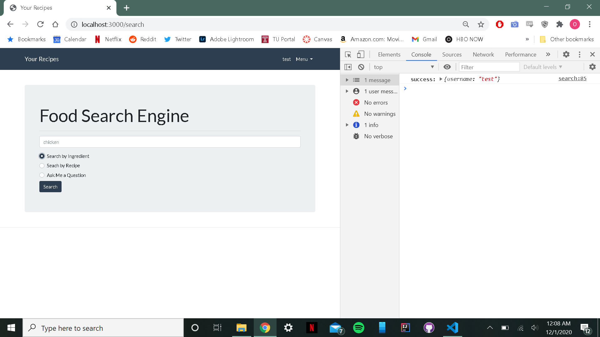
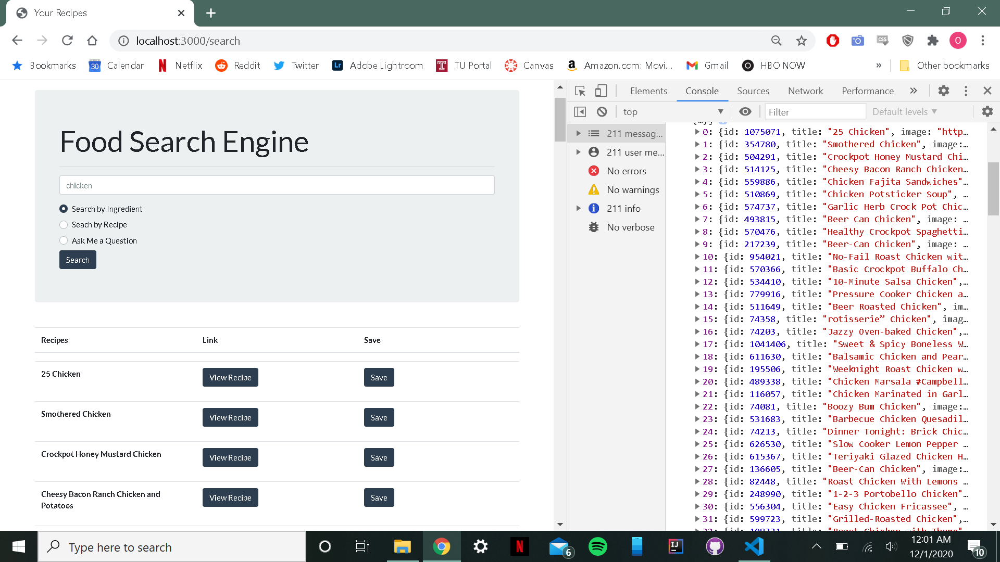

- A user can also search for recipes using multiple ingredients. Searching for "chicken, tomato, and rice" will display recipes that include all three ingredients.
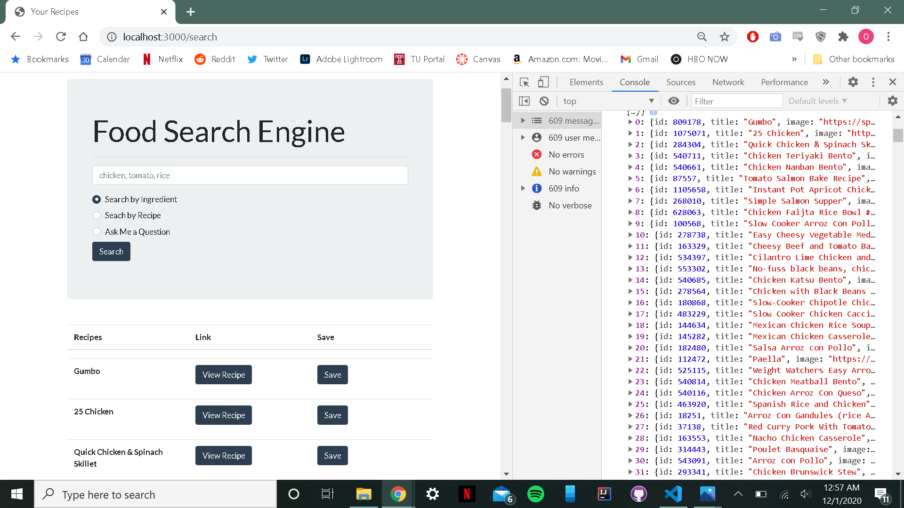

- Searching by recipe will display different variations of the recipe search query. By searching for "chicken pot pie," the results will display chicken pot pie recipes.

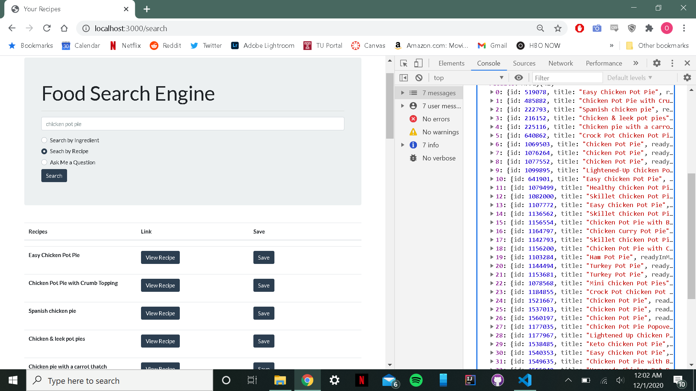

- Searching by question allows the user to ask for nutritional information. By searching "calories in chicken," the result displays the answer to the query.

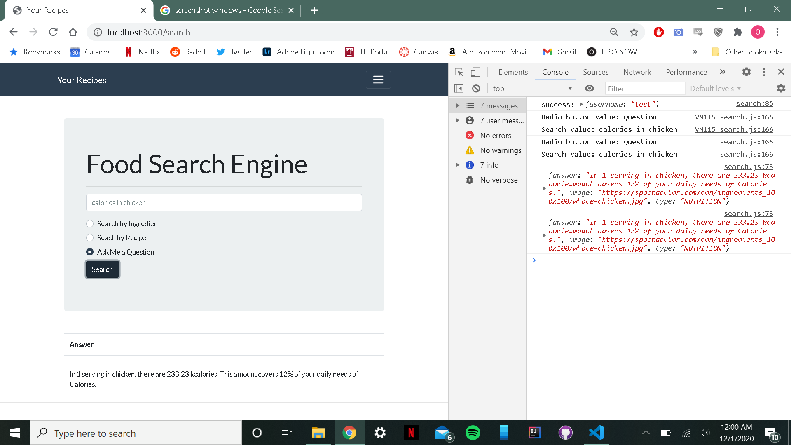

- Users can view the details of the recipes by selecting the "View Recipe" button. This will open a new tab that display all the details of the recipe including a description of the dish, nutritional information, and cooking instructions.
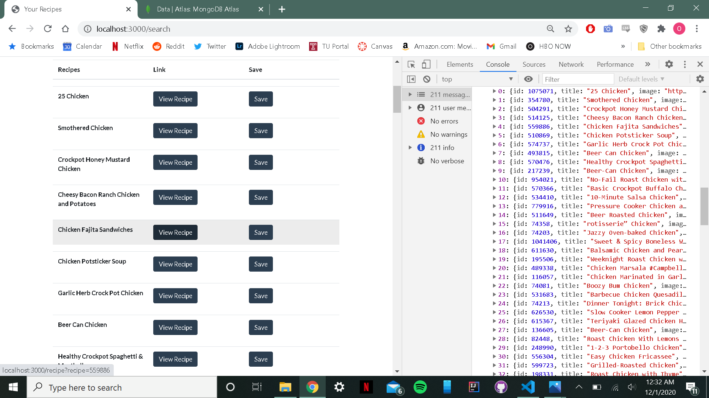
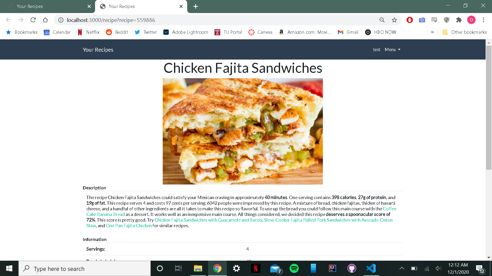

- Users can save recipes that they like or would like to try later. By clicking "Save" on a specific recipe, the server adds the recipe's ID to the user's corresponding document in the database. Saving "chicken fajitas sandwiches" passes the recipe ID (559886) to the database, and appends it to the corresponding user's JSON document.
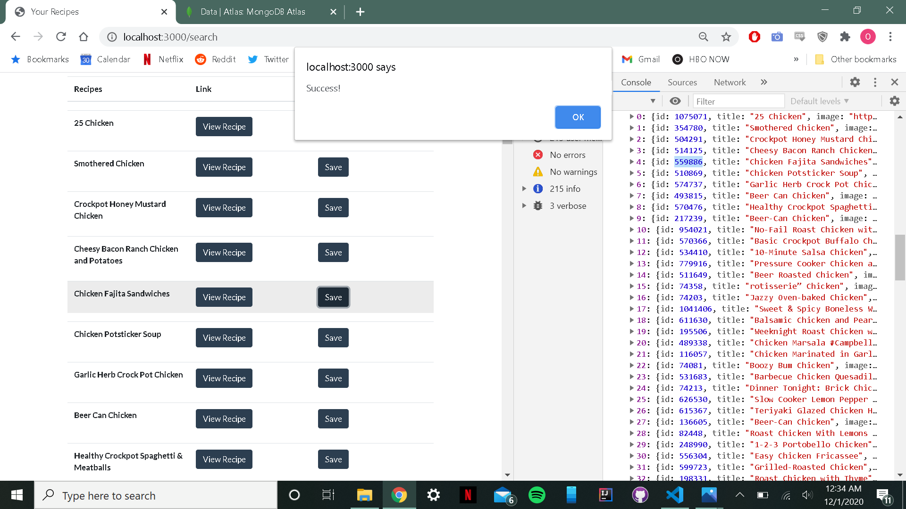
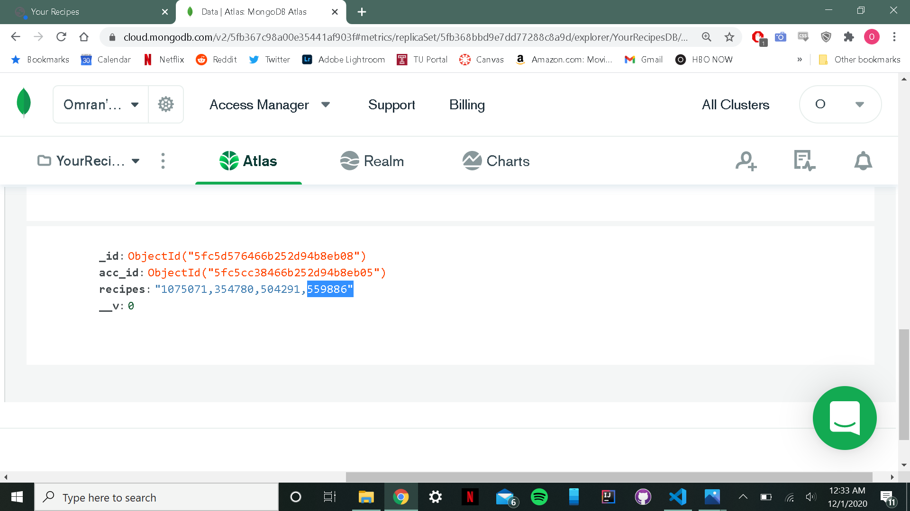

- Users can view the recipes they have saved in the "Saved Recipes" page. Using the database document that corresponds with the user and any saved recipe IDs, the page displays the name of the recipes as well as a link to view the recipe page and an option to delete the recipe from the list of saved recipes.
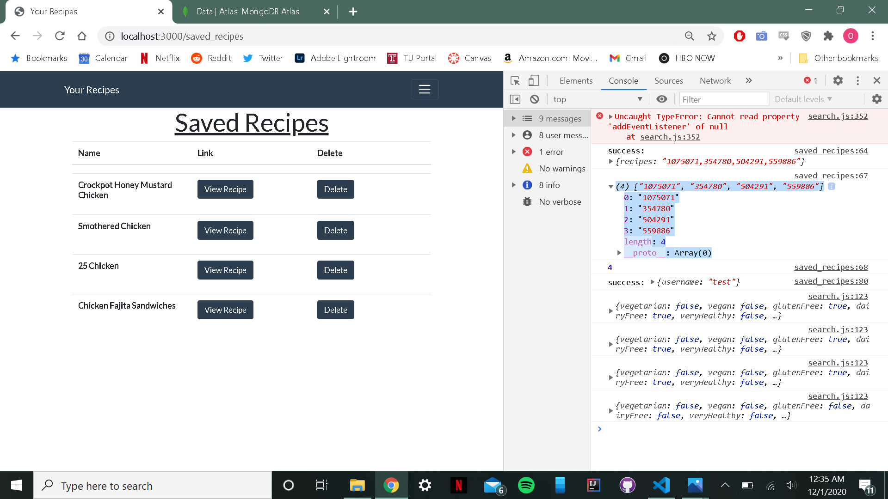
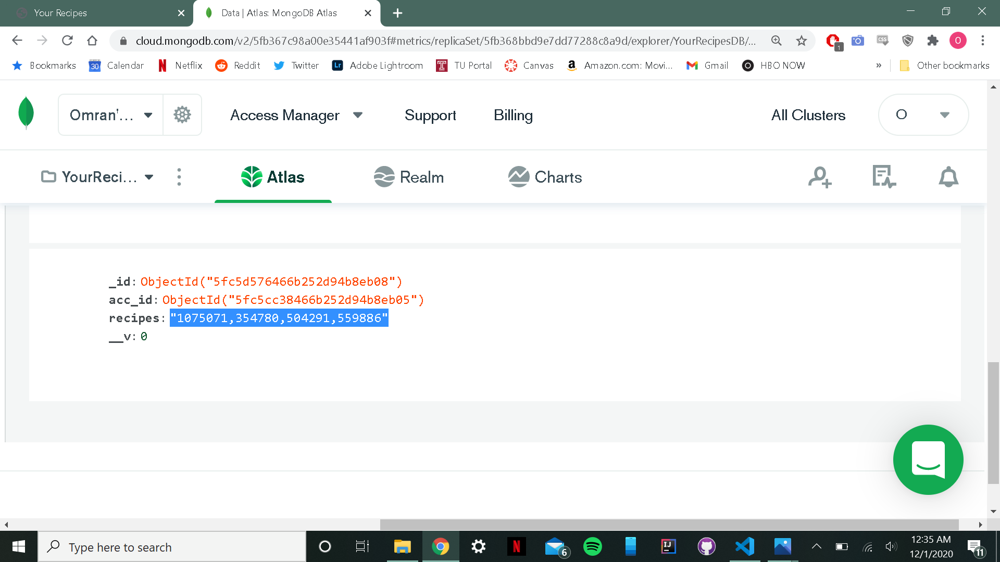

- Users can delete the recipes they no longer wish to keep saved by clicking the "Delete" button found on the "Saved Recipes" page. This has the server communicate with the database to remove the desired recipe ID from the corresponding user's document. Deleting the "25 Chickens Recipe" removes its corresponding recipe ID from the database.
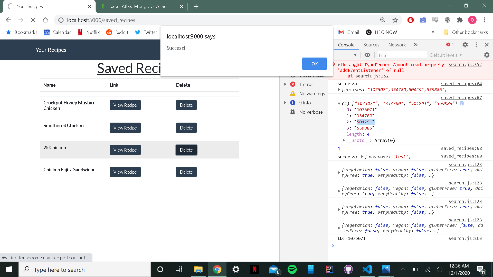
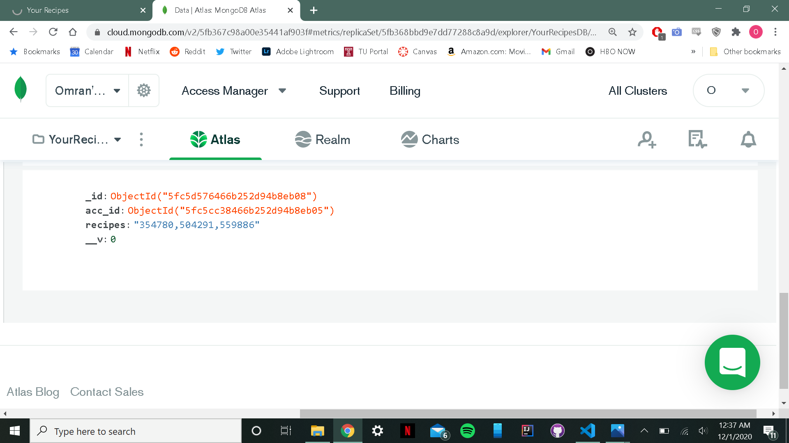

- Deleting refreshes the "Saved Recipes" without the deleted recipe.
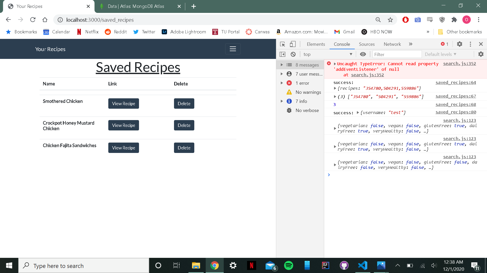
